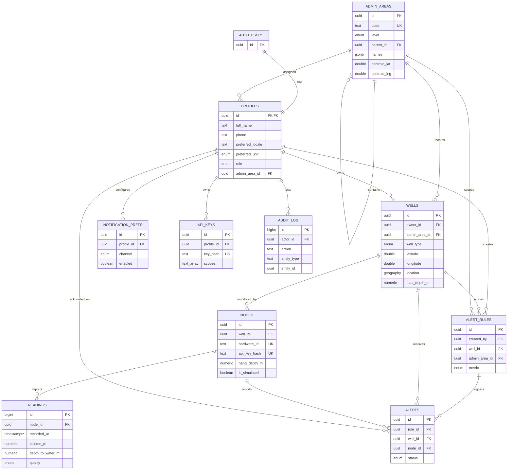

# Database

JalMaps uses the local Supabase Postgres project in `supabase/`. Apply schema changes
with forward-only migrations; dimensions are stored in metres and event times in
`timestamptz` (UTC instants).

## Entity relationship diagram

`latest_reading` is a security-invoker view over `readings`, not a separate entity.

## Tables

| Table                | Purpose and notable constraints                                                                                                                                           |
| -------------------- | ------------------------------------------------------------------------------------------------------------------------------------------------------------------------- |
| `profiles`           | App metadata for an `auth.users` identity. Stores role, locale, unit preference, optional administrative assignment, crop preferences and onboarding/deletion timestamps. |
| `admin_areas`        | State → district → block → village hierarchy, checked by a trigger. Localized names are JSONB; centroids and population are optional.                                     |
| `wells`              | Borewells, open wells, tanks and ponds; coordinates are range-checked and a generated PostGIS geography point has a GiST index.                                           |
| `nodes`              | Hardware registry, unique hardware ID, optional SHA-256 API-key hash, sensor calibration and simulated-device flag.                                                       |
| `readings`           | Append-oriented observations with a bigint identity and unique `(node_id, recorded_at)` key for idempotent writes.                                                        |
| `alert_rules`        | Threshold/device rules scoped to a well or administrative area, with severity and notification channels.                                                                  |
| `alerts`             | Triggered events with acknowledgement/resolution state and a translation `message_key`.                                                                                   |
| `notification_prefs` | One preference per profile and channel.                                                                                                                                   |
| `api_keys`           | API access metadata and rate limits; only a fixed-length SHA-256 digest is stored.                                                                                        |
| `audit_log`          | Operational record of actor, action, entity and structured details.                                                                                                       |

All ten tables have RLS enabled with the role-aware policies described in
[the Phase 5 RLS guide](./rls.md). The `latest_reading` view uses invoker security
so it cannot bypass the base table's RLS.

## Local workflow

1. Install dependencies with `pnpm install`; have Docker Desktop running.
2. Start the local stack with `pnpm db:start`.
3. Run `pnpm db:reset` to apply all migrations and load `supabase/seed.sql`.
4. Run `pnpm db:test` for SQL/pgTAP and repository integration tests.
5. Run `pnpm db:types` after schema changes, then commit the generated
   `src/lib/db/types.ts`. CI starts a clean stack and runs `pnpm db:types:check`.
6. Stop the stack with `pnpm db:stop`.

The seed creates two states, four districts, twelve blocks, thirty-six villages, six
onboarded role fixtures, one incomplete onboarding identity and thirty wells with
simulated nodes. Seed identities have local OTP phone numbers and no usable password;
see [the auth guide](./auth.md). It creates no readings. Treat seed identities as
local fixtures, not production accounts.

## Migration guidelines

- Name files `YYYYMMDDHHMMSS_short_description.sql`; group related DDL in one migration.
- Include constraints and foreign keys in the migration that creates the table.
- Enable RLS when creating tables. Until the role-policy phase, do not add permissive
  policies.
- Keep schema changes forward-only in deployed environments. Supabase CLI does not
  provide an automatic down-migration runner; if rollback is required before data is
  written, use these dependency-ordered operations:
  - Core/admin migration: drop the `profiles` and `admin_areas` tables, then
    `validate_admin_area_parent()`, then `unit_preference`, `user_role`, and
    `admin_area_level`.
  - Well/sensor migration: drop `readings`, `nodes`, and `wells`, then their five enums.
    Retain PostGIS because other extensions may depend on it.
  - Alert/access migration: drop `audit_log`, `api_keys`, `notification_prefs`,
    `alerts`, and `alert_rules`, then their five enums.
  - Functions/RLS migration: drop `latest_reading`, the depth helper, the updated-at
    triggers/function, and parent-validation trigger/function; disable RLS only when
    returning to the pre-Phase-4 schema.
- For migrations that have reached a shared or production database, prefer a new
  corrective migration over rollback. Never rewrite an applied migration.

## Data-access boundary

Zod schemas in `src/lib/schemas/` validate repository inputs. Repository functions in
`src/server/db/` own queries and surface database errors with their SQLSTATE; route
handlers should not contain query or domain logic. Browser clients use only the public
anon key, server clients use the cookie-aware anon client, and service-role access is
isolated in `src/server/db/service-client.ts`.
