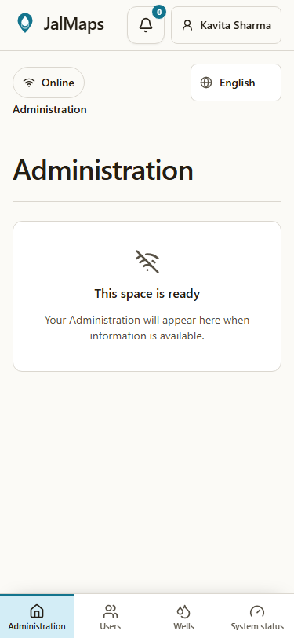
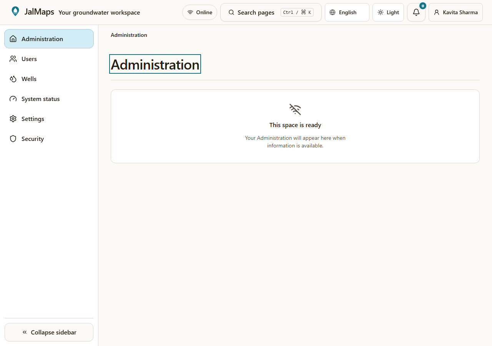
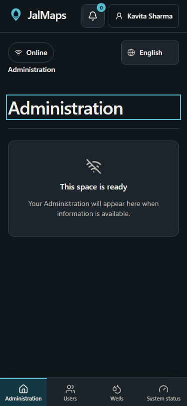
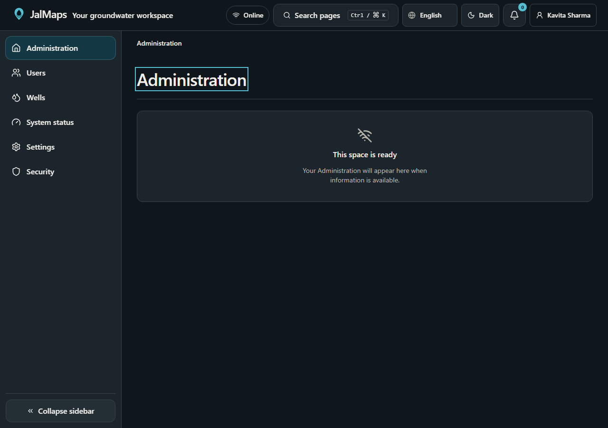
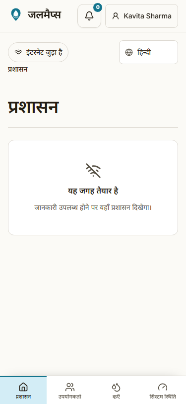
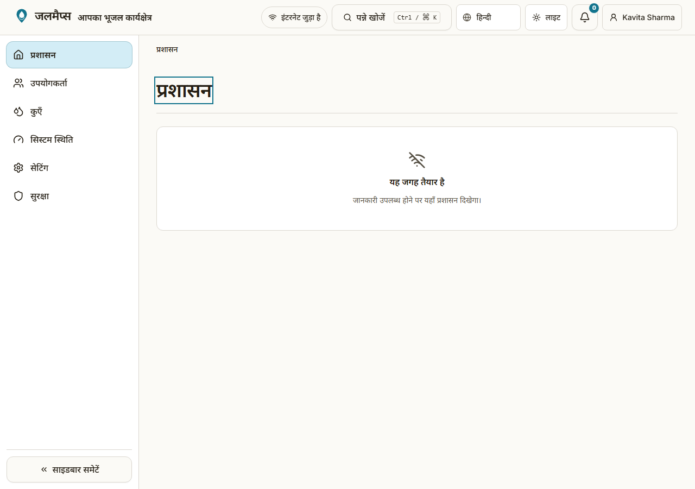
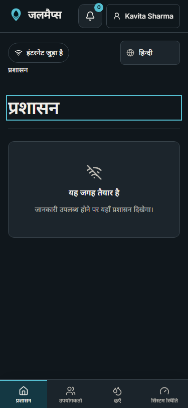
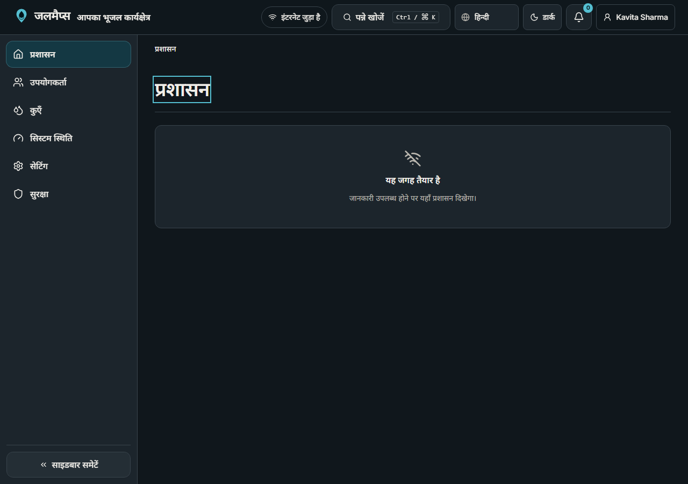

# Phase 06 — Application shell and navigation

- **Status:** Implementation and verification in progress
- **Branching:** Directly on `main`, per the phase workflow

## Design preview

The design preview is captured at 375px and 1280px in English and Hindi, with
light and dark appearance:

| Locale  | Theme | Mobile                                                                        | Desktop                                                                         |
| ------- | ----- | ----------------------------------------------------------------------------- | ------------------------------------------------------------------------------- |
| English | Light |  |  |
| English | Dark  |    |    |
| Hindi   | Light |    |    |
| Hindi   | Dark  |      |      |

## Delivered

- Public landing/login route group and protected signed-in shell route group.
- Trusted role-gated section destinations, typed navigation configuration,
  responsive mobile navigation and persisted collapsible desktop sidebar.
- Shared header controls, connectivity status, keyboard command palette,
  localized breadcrumbs, skip link and post-navigation heading focus.
- Profile-backed language, unit, text size and theme preferences with first-
  party cookies for immediate rendering.
- Localized loading, error, not-found, forbidden and empty states; shared page
  scaffolding and toast provider.
- English/Hindi translations, unit tests, database coverage and Playwright
  coverage at mobile and desktop viewport widths.

See [the shell guide](../app-shell.md) to add routes and navigation items.
